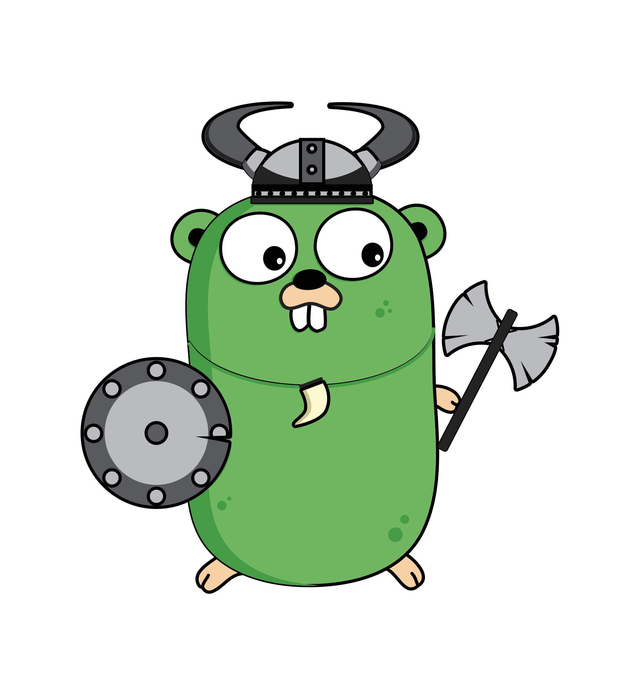
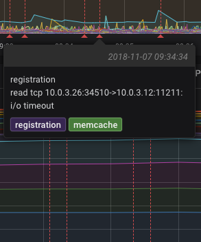

build-lists: true
theme: Courier, 4
autoscale: true

[.footer: #### Igor Karpovich]

## It's all about microservices
### Engineering challenges of running Docker Swarm

---

# Disclaimer

## Neither whales nor gophers were harmed

---
# The Goal

Decrease time to market, increase engineering speed and and product quality.

Increase number of engineers involved, improve cross-team communication.

Decrease number of incidents, improve incident resolution time.

---

# The Way

Disposable products:
- Immutable infrastructure
- Containers
- Microservices

---


# The WHY

- Experiment fast and safe
- Be happy to make mistakes and learn
- See anomalies and improvements at scale

---


# Version Zero
## First microservice (2015)

- REST API only
- Monitoring coverage
- Plugged into core app
- Traditional deployment
- Written in PHP

---


# Swarm
## Out of the box

- Service discovery
- Networking (mesh routing and custom networks)
- Volumes (EBS/EFS in AWS)
- Orchestration with Compose
- Configs, secrets

---


# Swarm
## Missing bits

- Job runner
- Cron scheduler
- Autoscaling
- Access control
- Request tracing

---

# How do we do the rest?

---


# Docker API!

[.code-highlight: none]
[.code-highlight: 4]
[.code-highlight: 5]
[.code-highlight: 6]
[.code-highlight: all]


```go
import "github.com/docker/docker/client"

func main() {
  client, err := client.NewClientWithOpts(client.FromEnv)
  stack := DeployStack(client, ymlPath)
  PollStackTasks(stack)
}
```

---
# Cron scheduler
[.code-highlight: none]
[.code-highlight: 2]
[.code-highlight: 3]
[.code-highlight: 4]
[.code-highlight: 10]
[.code-highlight: all]
```go

func main() {
  cron := NewScheduler()
  cron.on("*/10 * * *", func(task CronTask, ctx context.Context){
      err := SetDistributedLock(task, ctx)

      if err != nil {
        return errors.New("Oops!")
      }

      return ExecuteTask(task, ctx) // Emit event to a message bus
  })
}

```

---


# Autoscaling

- `Docker for AWS` addresses syncing between EC2 ASG and Swarm
- `Workers autoscaling:` calculating reserved resources per node
- `Services autoscaling:` relying operational metrics to scale services via Docker API

---


# Access control

- IAM-like model
- Treat services as users
- JWT and SAML
- 2FA
- Regular token audit
- SDK to plug into ecosystem

---



# Goblin

## Microservice framework

---

## Some of Goblin's features

- Runtime (module) management
- Config management
- Storage & Cache
- Transport (HTTP Server/Client, WS router)
- Monitoring client and metrics (Gin, WS router, go runtime)
- Logging (context data injection, sentry.io integration)
- Healthchecks
- Tracing

^ Mention SDK

---



# Healthchecks as metrics

- Docker native support
- Expose metrics
- Push to InfluxDB
- Visualisation

---


# Distributed tracing
## Trace everything!
- HTTP/WS Server
- HTTP Client
- SQL
- NoSQL
- MQ
- Events
- Emails

---

# Platform toolkit

- Clusters self-deployment (traefik, CI, monitoring, logging, tracing)
- GitOps
- Secret management
- Service wide event broadcast
- Change Audit
- Multi-route email delivery
- Monitoring (InfluxDB, Grafana, Slack, TV dashboards)

---

# Questions!

[.footer: #### Twitter: @ikarpovich]
